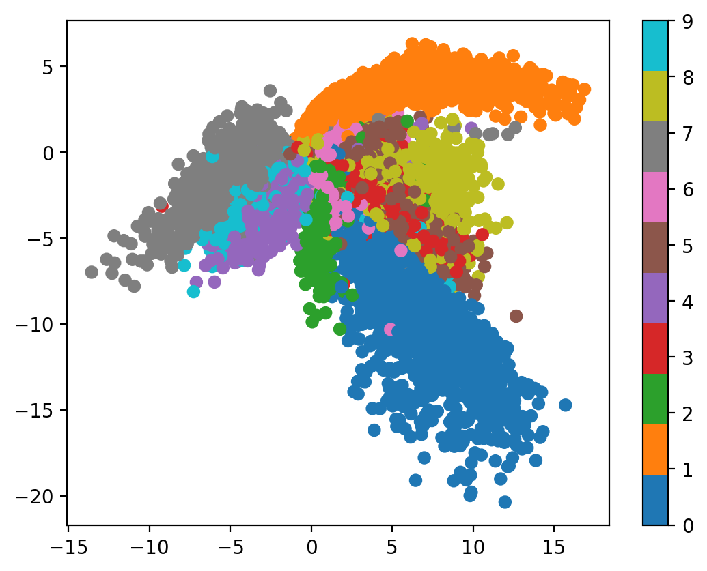
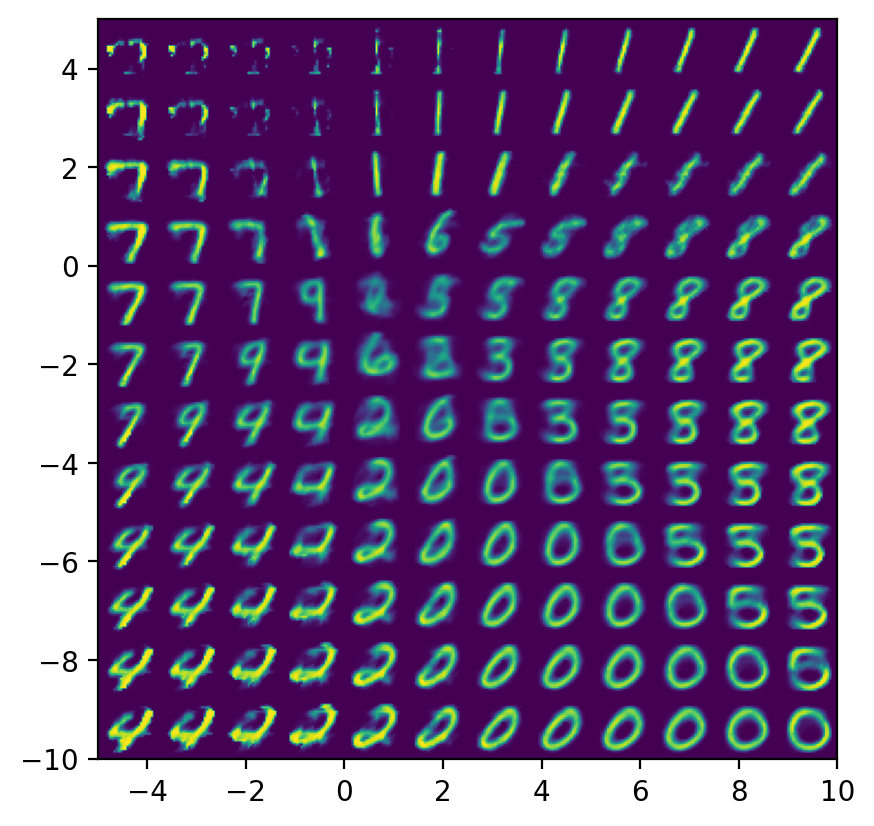
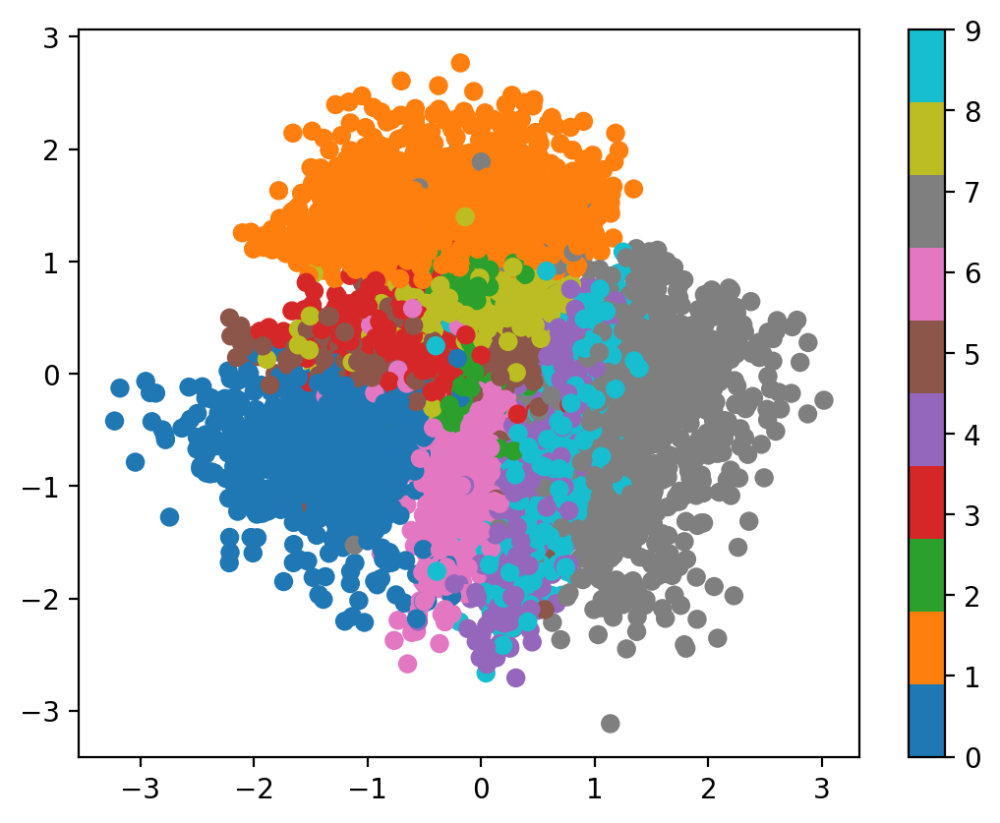
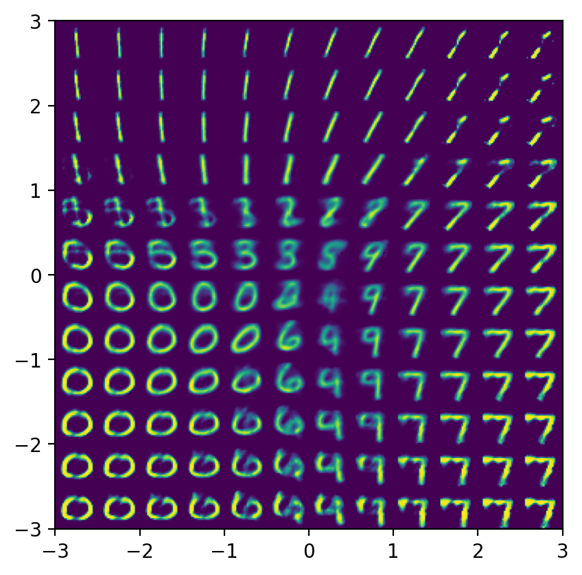
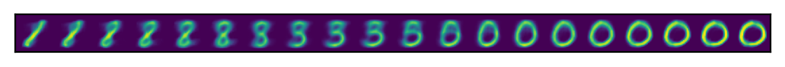
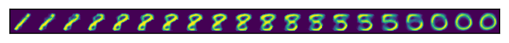

# Background

本文原作者为[Alexander Van de Kleut](https://avandekleut.github.io/vae/)。翻译由[Deepseek](https://www.deepseek.com/)生成，并经由本人检查。若翻译存在任何不准确的地方，还请参考原文。

> 在不影响主要内容的情况下，本人将添加适当的注释。

# Motivation

假设我们拥有一个大规模的高维数据集。例如，考虑一个由数千张图像组成的数据集。每张图像由数百个像素构成，因此每个数据点均有数百个维度。**[流形假设](https://deepai.org/machine-learning-glossary-and-terms/manifold-hypothesis)** 指出，真实世界中的高维数据实际上是由嵌入高维空间中的低维数据所组成。这意味着，尽管实际数据本身可能具有数百个维度，但数据的内在结构仅需少数维度即可充分描述。

这正是降维技术背后的动机，旨在将高维数据投影到低维表面上。对于大多数习惯于在二维（或偶尔三维）空间中可视化信息的人而言，这意味着将数据投影到二维表面。降维技术的示例包括[主成分分析（PCA）](https://en.wikipedia.org/wiki/Principal_component_analysis)和[t-分布随机邻域嵌入（t-SNE）](https://en.wikipedia.org/wiki/T-distributed_stochastic_neighbor_embedding)。Chris Olah的博客中有一篇[优秀文章](https://colah.github.io/posts/2014-10-Visualizing-MNIST/)，回顾了应用于MNIST数据集的一些降维技术。

神经网络常应用于**监督学习**场景，该场景下的数据由若干对$(x, y)$组成，网络通过学习得到一个函数$f:X \to Y$。这一框架既适用于**回归问题**（其中$y$是$x$的连续函数），也适用于**分类问题**（其中$y$是$x$的离散标签）。然而，神经网络在**无监督学习**场景中也表现出显著优势，此类场景的数据仅包含数据点$x$，不存在“目标”或“标签”$y$。其目标在于学习并理解数据的内部结构。就降维而言，其目标是寻找数据的低维表示。

# Autoencoders

自编码器是一种用于实现降维的特殊神经网络。我们可以将其视为由两个网络组成：一个**编码器** $e$ 和一个**解码器** $d$。

编码器学习一个非线性变换 $e:X \to Z$，该变换将数据从原始的高维输入空间 $X$ 投影到一个低维的**潜空间** $Z$。我们将 $z = e(x)$ 称为一个**潜向量**。潜向量是数据点 $x$ 的一种低维表示，其中包含了关于 $x$ 的信息。变换 $e$ 应具备某些特性，例如相似的 $x$ 值应具有相似的潜向量（而不相似的 $x$ 值应具有不相似的潜向量）。

解码器学习一个非线性变换 $d: Z \to X$，该变换将潜向量投影回原始的高维输入空间 $X$。此变换应能利用潜向量 $z = e(x)$ 来重构原始输入数据 $\hat{x} = d(z) = d(e(x))$。

自编码器即是编码器与解码器的组合 $f(x) = d(e(x))$。训练自编码器的目标是通过一种**重构损失**函数来最小化输入 $x$ 与重构结果 $\hat{x}$ 之间的差异。由于自编码器作为一个整体进行训练（我们称其为“端到端”训练），因此我们同时优化编码器和解码器。

以下是一个使用 PyTorch 实现的自编码器代码。我们将其应用于 MNIST 数据集。

```py
import torch
import torch.utils
import torch.nn as nn
import torch.distributions
import torch.nn.functional as F
torch.manual_seed(0)
import torchvision
import numpy as np
import matplotlib.pyplot as plt
plt.rcParams['figure.dpi'] = 200
from PIL import Image
device = 'cuda' if torch.cuda.is_available() else 'cpu'
```

以下我们通过继承 `torch.nn.Module` 类来编写 `Encoder` 类。这种方式允许我们在 `__init__` 方法中定义并存储网络层作为属性，并通过 `forward` 方法来描述网络的前向传播过程。

```py
class Encoder(nn.Module):
    def __init__(self, input_dims, hidden_dims, latent_dims):
        super(Encoder, self).__init__()
        self.linear1 = nn.Linear(input_dims, hidden_dims)
        self.linear2 = nn.Linear(hidden_dims, latent_dims)
    
    def forward(self, x):
        x = torch.flatten(x, start_dim=1)
        x = F.relu(self.linear1(x))
        return self.linear2(x)
```

我们为`Decoder`类采用了类似的方法。

```py
class Decoder(nn.Module):
    def __init__(self, latent_dims, hidden_dims, output_dims):
        super(Decoder, self).__init__()
        self.linear1 = nn.Linear(latent_dims, hidden_dims)
        self.linear2 = nn.Linear(hidden_dims, output_dims)

    def forward(self, z):
        z = F.relu(self.linear1(z))
        z = torch.sigmoid(self.linear2(z))
        return z
```

最后，我们编写一个整合了编码器与解码器的`Autoencoder`类。需要指出的是，虽然我们可以轻松地将整个自编码器实现为单个神经网络，但将其拆分为两个部分能使概念表述更为清晰。

```py
class Autoencoder(nn.Module):
    def __init__(self, latent_dims, input_dims, hidden_dims, output_dims):
        super(Autoencoder, self).__init__()
        self.encoder = Encoder(input_dims, hidden_dims, latent_dims)
        self.decoder = Decoder(latent_dims, hidden_dims, output_dims)

    def forward(self, x):
        z = self.encoder(x)
        z = self.decoder(z)
        return z.reshape((-1, 1, x.shape[2], x.shape[3]))  # x.shape [batch, 1, 28, 28]
```

> 此处对原文中代码进行了略微调整。
> 引入`input_dims`与`hidden_dims`使代码更规范易读。
> 在`Autoencoder`类的`forward`方法中`reshape`最终结果而非`Decoder`类中。
> 同样，在后续`VariationalEncoder`与`VariationalAutoencoder`类中，也进行了相似的调整，不再赘述。

接下来，我们将编写相应的代码，以在MNIST数据集上训练该自编码器。

```py
def train(autoencoder, data, epochs=20):
    opt = torch.optim.Adam(autoencoder.parameters())
    for epoch in range(epochs):
        loss_sum = 0
        for x, y in data:
            x = x.to(device)  # GPU
            opt.zero_grad()
            x_hat = autoencoder(x)
            loss = ((x - x_hat)**2).sum()
            loss_sum += loss.item()
            loss.backward()
            opt.step()
        print(f"Epoch {epoch}, loss {loss_sum}")
    return autoencoder

latent_dims = 2
autoencoder = Autoencoder(latent_dims, input_dims=28*28, hidden_dims=512, output_dims=28*28).to(device)  # GPU

data = torch.utils.data.DataLoader(
        torchvision.datasets.MNIST('./data', 
               transform=torchvision.transforms.ToTensor(), 
               download=True),
        batch_size=128,
        shuffle=True)

autoencoder = train(autoencoder, data)
```

> 此处，作者设定`latent_dims=2`用于后续可视化呈现。
> 由于`Decoder`与`Autoencoder`类的更改，此处同样对原文中代码进行了略微调整。
> 此外，增加了`loss_sum`变量统计每个Epoch的损失，以展示模型训练结果。
> 代码执行结果如下。

```text
Epoch 0, loss 2659814.2380371094
Epoch 1, loss 2256156.6586914062
Epoch 2, loss 2177884.2548828125
Epoch 3, loss 2130104.6767578125
Epoch 4, loss 2093778.4323730469
Epoch 5, loss 2063126.5483398438
Epoch 6, loss 2040471.1433105469
Epoch 7, loss 2020188.4909667969
Epoch 8, loss 2001980.3969726562
Epoch 9, loss 1986093.8352050781
Epoch 10, loss 1973533.6118164062
Epoch 11, loss 1961524.6513671875
Epoch 12, loss 1949737.0246582031
Epoch 13, loss 1940271.1206054688
Epoch 14, loss 1931843.240234375
Epoch 15, loss 1925252.7309570312
Epoch 16, loss 1915144.6496582031
Epoch 17, loss 1909307.216796875
Epoch 18, loss 1902923.6359863281
Epoch 19, loss 1895050.8400878906
```

训练完成自编码器后，我们应关注哪些方面？作者认为以下几点具有参考价值：

1.  **考察潜空间**：若潜空间为二维，则可通过编码器对一批输入数据 $x$ 进行变换，并将其输出向量以散点图形式呈现。鉴于MNIST数据集包含标签信息，我们可以对不同类别输出结果进行颜色编码，以便直观观察其分布特性。
2.  **对潜空间进行采样以生成输出**：若潜空间为二维，我们可以在均匀网格上对潜向量 $z$ 进行采样，并将解码后的潜向量以网格形式进行可视化呈现。

```py
def plot_latent(autoencoder, data, num_batches=100):
    for i, (x, y) in enumerate(data):
        z = autoencoder.encoder(x.to(device))
        z = z.to('cpu').detach().numpy()
        plt.scatter(z[:, 0], z[:, 1], c=y, cmap='tab10')
        if i > num_batches:
            plt.colorbar()
            break

plot_latent(autoencoder, data)
```

> 代码执行结果如下。



训练所得的潜向量能够将相似的数字样本聚类在一起。同时，我们还可以从潜空间中进行均匀采样，进而观察解码器如何根据任意潜向量重构输入数据。

```py
def plot_reconstructed(autoencoder, r0=(-10, 10), r1=(-10, 10), n=10):
    w = 28
    img = np.zeros((n*w, n*w))
    for i, y in enumerate(np.linspace(*r1, n)):
        for j, x in enumerate(np.linspace(*r0, n)):
            z = torch.Tensor([[x, y]]).to(device)
            x_hat = autoencoder.decoder(z)
            x_hat = x_hat.reshape(28, 28).to('cpu').detach().numpy()
            img[(n-1-i)*w:(n-1-i+1)*w, j*w:(j+1)*w] = x_hat
    plt.imshow(img, extent=[*r0, *r1])

plot_reconstructed(autoencoder)
```

> 代码执行结果如下。



我们有意采用与实际潜向量数值范围相近的尺度来绘制重构的潜向量。可以观察到，重构后的潜向量呈现出数字形态，且数字的类别与潜向量在潜空间中的位置存在对应关系。

你可能已经注意到，潜空间中存在一些从未被数据映射到的"间隙"区域。当我们尝试将自编码器用作**生成模型**时，这就成为了一个问题。生成模型的目标是从数据集$X$中学习分布，并生成与$X$同分布的新数据点。对自编码器而言，这意味着从潜空间$Z$中采样潜向量$z \sim Z$，然后通过解码器将这些潜向量解码生成图像。如果我们从潜空间中某个解码器在训练期间从未见过的区域采样潜向量，其输出可能完全无法形成有意义的图像。这一点在`plot_reconstructed`输出的左上角区域尤为明显——该区域在潜空间中处于空白状态，而对应的解码数字也无法匹配任何现有数字类别。

# Variational Autoencoders

传统自编码器对潜向量表示的唯一约束，是潜向量应当能够被顺利解码回原始图像。这种约束可能导致潜空间 $Z$ 变得不连通且不连续。而变分自编码器则致力于解决这一问题。

在传统自编码器中，输入数据被确定性映射至一个潜向量 $z = e(x)$；而在变分自编码器中，输入数据被映射为潜空间上的概率分布，随后从该分布中采样生成潜向量。这种设计使得解码器在解码潜向量时具有更强的鲁棒性。

具体而言，我们不再将输入 $x$ 映射为确定的潜向量 $z = e(x)$，而是将其映射为均值向量 $\mu(x)$ 和标准差向量 $\sigma(x)$。这两个参数定义了一个对角高斯分布 $\mathcal{N}(\mu, \sigma)$，随后我们从该分布中采样得到潜向量 $z \sim \mathcal{N}(\mu, \sigma)$。

这一机制通常通过以下方式实现：将传统自编码器的最后一层替换为两个并行输出层，分别生成 $\mu(x)$ 和 $\sigma(x)$。通常对 $\sigma(x)$ 采用指数激活函数以确保其输出值为正。

然而，这并未完全解决问题。由于编码器输出的均值可能差异显著且标准差较小，潜空间中仍可能存在间隙。为缓解此问题，我们引入一项**辅助损失函数**，用于惩罚后验分布 $p(z \mid x)$ 与标准正态分布 $\mathcal{N}(0, 1)$ 之间的偏离。该惩罚项即为 $p(z \mid x)$ 与 $\mathcal{N}(0, 1)$ 之间的KL散度，其表达式如下：
$$
\mathbb{KL}\left( \mathcal{N}(\mu, \sigma) \parallel \mathcal{N}(0, 1) \right) = \sum_{x \in X} \left( \sigma^2 + \mu^2 - \log \sigma - \frac{1}{2} \right)
$$

该表达式适用于两个单变量高斯分布（两个任意单变量高斯分布的完整表达式推导可参阅[此数学stackexchange帖子](https://stats.stackexchange.com/questions/7440/kl-divergence-between-two-univariate-gaussians)）。将其扩展到我们的对角高斯分布并不困难；我们只需对每个维度的KL散度进行求和。

该损失函数的重要性体现在两个方面。首先，若没有此项，我们将无法通过梯度下降法训练编码器网络，因为梯度无法通过采样操作（这是一种不可微操作）进行反向传播。其次，通过以这种方式惩罚KL散度，我们可以促使潜向量分布更集中于中心区域且更均匀。实质上，我们强制编码器寻找近似遵循标准高斯分布的潜向量，从而使得解码器能够有效地进行解码。

为实现该机制，我们无需修改 `Decoder` 类，仅需调整 `Encoder` 类使其输出 $\mu(x)$ 和 $\sigma(x)$，并利用这两个参数对潜向量进行采样。同时，我们通过该类来记录 KL 散度损失项。

```py
class VariationalEncoder(nn.Module):
    def __init__(self, input_dims, hidden_dims, latent_dims):
        super(VariationalEncoder, self).__init__()
        self.linear1 = nn.Linear(input_dims, hidden_dims)
        self.linear2 = nn.Linear(hidden_dims, latent_dims)
        self.linear3 = nn.Linear(hidden_dims, latent_dims)
        self.N = torch.distributions.Normal(0, 1)
        self.N.loc = self.N.loc.cuda()  # hack to get sampling on the GPU
        self.N.scale = self.N.scale.cuda()
        self.kl = 0
    
    def forward(self, x):
        x = torch.flatten(x, start_dim=1)
        x = F.relu(self.linear1(x))
        mu =  self.linear2(x)
        sigma = torch.exp(self.linear3(x))
        z = mu + sigma * self.N.sample(mu.shape)
        self.kl = (sigma**2 + mu**2 - torch.log(sigma) - 1 / 2).sum()
        return z
```

自编码器类仅需修改一行代码：将原有的 `Encoder` 替换为 `VariationalEncoder`。

```py
class VariationalAutoencoder(nn.Module):
    def __init__(self, latent_dims, input_dims, hidden_dims, output_dims):
        super(VariationalAutoencoder, self).__init__()
        self.encoder = VariationalEncoder(input_dims, hidden_dims, latent_dims)
        self.decoder = Decoder(latent_dims, hidden_dims, output_dims)
    
    def forward(self, x):
        z = self.encoder(x)
        z = self.decoder(z)
        return z.reshape((-1, 1, x.shape[2], x.shape[3]))  # x.shape [batch, 1, 28, 28]
```

为训练该变分自编码器，我们仅需在训练算法中引入辅助损失项。

以下代码基本直接复用自前文，仅在损失函数中增加了单个项（`autoencoder.encoder.kl`）。

```py
def train(autoencoder, data, epochs=20):
    opt = torch.optim.Adam(autoencoder.parameters())
    for epoch in range(epochs):
        loss_sum = 0
        for x, y in data:
            x = x.to(device)  # GPU
            opt.zero_grad()
            x_hat = autoencoder(x)
            loss = ((x - x_hat)**2).sum() + autoencoder.encoder.kl
            loss_sum += loss.item()
            loss.backward()
            opt.step()
        print(f"Epoch {epoch}, loss {loss_sum}")
    return autoencoder

vae = VariationalAutoencoder(latent_dims, input_dims=28*28, hidden_dims=512, output_dims=28*28).to(device)  # GPU
vae = train(vae, data)
```

> 代码执行结果如下。

```text
Epoch 0, loss 2955577.134033203
Epoch 1, loss 2552912.4067382812
Epoch 2, loss 2485355.9907226562
Epoch 3, loss 2450261.1396484375
Epoch 4, loss 2424921.4663085938
Epoch 5, loss 2406059.8532714844
Epoch 6, loss 2390072.5771484375
Epoch 7, loss 2378411.9150390625
Epoch 8, loss 2368219.838623047
Epoch 9, loss 2357933.98046875
Epoch 10, loss 2348506.4125976562
Epoch 11, loss 2340736.010498047
Epoch 12, loss 2332036.6352539062
Epoch 13, loss 2324677.318359375
Epoch 14, loss 2317244.8361816406
Epoch 15, loss 2311711.3540039062
Epoch 16, loss 2304684.862060547
Epoch 17, loss 2297983.3569335938
Epoch 18, loss 2292442.5766601562
Epoch 19, loss 2286543.677001953
```

我们将绘制若干批数据的潜向量表示散点图。

```py
plot_latent(vae, data)
```

> 代码执行结果如下。



可以观察到，相较于传统自编码器，变分自编码器生成的潜向量数值范围显著缩小且分布更为集中。潜变量的后验分布 $p(z \mid x)$ 整体上更接近高斯分布。

接下来让我们观察潜空间重构的数字样本：

```py
plot_reconstructed(vae, r0=(-3, 3), r1=(-3, 3))
```

> 代码执行结果如下。



# Conclusions

与传统自编码器相比，变分自编码器所生成的潜空间 $Z$ 具有更高的紧凑性与平滑度。这使得我们能够通过随机采样潜空间中的点 $z \sim Z$，并生成对应的重构结果 $\hat{x} = d(z)$，从而产生具有现实意义的数字图像——这一特性是传统自编码器所不具备的。

# Extra Fun

最后需要探讨的是**插值**方法。给定两个输入样本 $x_1$ 和 $x_2$ 及其对应的潜向量 $z_1$ 和 $z_2$，我们可以通过对两者之间的潜向量进行解码来实现样本间的连续过渡。

以下代码将生成一组图像序列，展示数字之间的连续插值过渡。

```py
def interpolate(autoencoder, x_1, x_2, n=12):
    z_1 = autoencoder.encoder(x_1)
    z_2 = autoencoder.encoder(x_2)
    z = torch.stack([z_1 + (z_2 - z_1)*t for t in np.linspace(0, 1, n)])
    interpolate_list = autoencoder.decoder(z)
    interpolate_list = interpolate_list.to('cpu').detach().numpy()
    w = 28
    img = np.zeros((w, n*w))
    for i, x_hat in enumerate(interpolate_list):
        img[:, i*w:(i+1)*w] = x_hat.reshape(28, 28)
    plt.imshow(img)
    plt.xticks([])
    plt.yticks([])

x, y = next(iter(data))  # hack to grab a batch
x_1 = x[y == 1][1].to(device)  # find a 1
x_2 = x[y == 0][1].to(device)  # find a 0

interpolate(vae, x_1, x_2, n=20)
```

> 代码执行结果如下。



```py
interpolate(autoencoder, x_1, x_2, n=20)
```

> 代码执行结果如下。



此外，作者还希望编写相应代码以生成描述过渡过程的动态GIF图像，而非仅呈现静态图像序列。以下代码通过修改前述实现方案，最终输出可动态演示插值过程的GIF文件。

```py
def interpolate_gif(autoencoder, filename, x_1, x_2, n=100):
    z_1 = autoencoder.encoder(x_1)
    z_2 = autoencoder.encoder(x_2)
    z = torch.stack([z_1 + (z_2 - z_1)*t for t in np.linspace(0, 1, n)])
    interpolate_list = autoencoder.decoder(z)
    interpolate_list = interpolate_list.to('cpu').detach().numpy()*255
    images_list = [Image.fromarray(img.reshape(28, 28)).resize((256, 256)) for img in interpolate_list]
    images_list = images_list + images_list[::-1]  # loop back beginning
    images_list[0].save(
        f'{filename}.gif', 
        save_all=True, 
        append_images=images_list[1:],
        loop=1)

interpolate_gif(vae, "vae", x_1, x_2)
```

> 代码执行结果如下。

